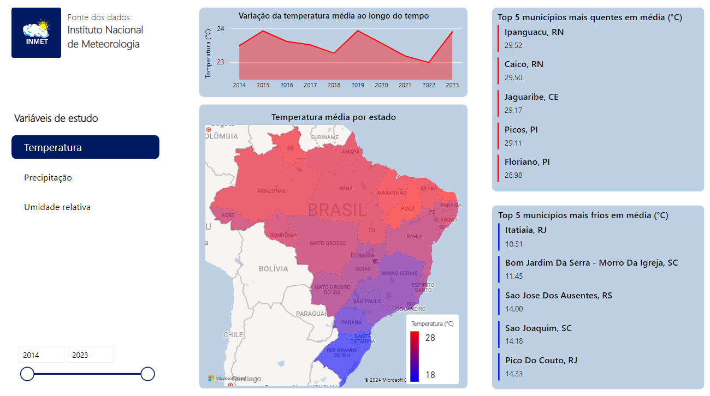

# Análise de dados climáticos brasileiros

O objetivo deste projeto é treinar técnicas de tratamento de dados utilizando Python e Power Query, bem como também treinar a criação de dashboards interativos utilizando Power BI.

## Obtenção dos dados

Os dados utilizados neste projeto representam medições de variáveis meteorológicas provenientes de 610 estações espalhadas ao longo dos 27 estados do território brasileiro entre os anos de 2014 e 2023. Estes dados podem ser baixados [no site do INMET - Instituto Nacional de Meteorologia](https://portal.inmet.gov.br/dadoshistoricos).

## Tratamento prévio usando Python

Os arquivos com as medições das variáveis meteorológicas estavam separadas por ano e por estação. Utilizando Python, foram realizadas as seguintes etapas de processamento dos dados:

1. Leitura e tratamento do cabeçalho de cada um dos arquivos;
2. Agrupamento dos dados por data calculando o valor mais adequado para cada variável (média, mínimo ou máximo);
3. Concatenação dos dados de todos os arquivos em um único dataset;
4. Armazenamento do dataset no arquivo `/processed_weather_data/weather_data.csv` (arquivo adicionado ao `.gitignore` devido ao tamanho).

O arquivo que contém estas etapas de processamento dos dados está no caminho `/src/data_processing.ipynb`.

## Tratamento e visualização dos dados usando Power BI

O arquivo único foi importado para o Power BI e, utilizando o Power Query, foram aplicadas as seguintes etapas de processamento:

1. Adição dos nomes dos estados em conjunto com as UFs utilizando a [API de localidades do IBGE](https://servicodados.ibge.gov.br/api/v1/localidades/estados);
2. Remoção de outliers.

Após este processamento, foi construído um dashboard evidenciando insights sobre as variáveis **temperatura**, **precipitação** e **umidade relativa do ar**. A imagem abaixo ilustra o dashboard construído em Power BI:

